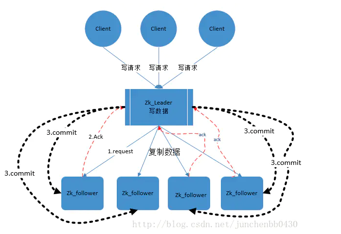
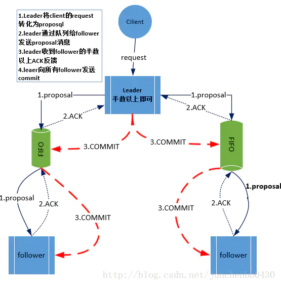

# 文章

## Zookeeper 入门看这篇就够了
https://blog.csdn.net/java_66666/article/details/81015302
上面的解释有点抽象，简单来说zookeeper=文件系统+监听通知机制。

## [实例详解ZooKeeper ZAB协议、分布式锁与领导选举](https://mp.weixin.qq.com/s?__biz=MzI4NTA1MDEwNg==&mid=2650764806&idx=1&sn=48d6d8a99bbaee3dcac2e12e3bf04ea7&chksm=f3f9c393c48e4a85dd5e4b2f741934ec3919c7fc4d4b7cfc26422f6f0977fbcafb8b30dcec5a&mpshare=1&scene=24&srcid=0105FEZLQd1wIshoJGfSDSX4&key=e58c60872eb97b11b762dca1ca1a39524e285b7e7e284fa90d835cc587cd24be77863773de3eb26f4f361ce6d2cc7102954c85abb312df1ae20260f353cfbffe6df7e7547f7d769809a9156ad4122cb5&ascene=0&uin=Nzc5NTUyMTQw&devicetype=iMac14%252C1+OSX+OSX+10.12.5+build(16F73)&version=12020610&nettype=WIFI&lang=zh_CN&fontScale=100&pass_ticket=S3JxgA9EegL3%252FLyZHJR7A4UUD6efECHmVViRoiiCAEvrQ%252FsOgKfJU7SiM8TTfYn3)

## [Zab协议详解](https://blog.csdn.net/liuchang19950703/article/details/111406622)（这篇文章对zab协议讲得很清楚）

>## Zab协议原理
>
>Zab协议要求每个 Leader 都要经历三个阶段：**发现，同步，广播**。
>
>- **发现**：要求zookeeper集群必须选举出一个 Leader 进程，同时 Leader 会维护一个 Follower 可用客户端列表。将来客户端可以和这些 Follower节点进行通信。
>- **同步**：Leader 要负责将本身的数据与 Follower 完成同步，做到多副本存储。这样也是提现了CAP中的高可用和分区容错。Follower将队列中未处理完的请求消费完成后，写入本地事务日志中。
>- **广播**：Leader 可以接受客户端新的事务Proposal请求，将新的Proposal请求广播给所有的 Follower。
>
>## Zab协议核心
>
>Zab协议的核心：**定义了事务请求的处理方式**
>
>1）所有的事务请求必须由一个全局唯一的服务器来协调处理，这样的服务器被叫做 **Leader服务器**。其他剩余的服务器则是 **Follower服务器**。
>
>2）Leader服务器 负责将一个客户端事务请求，转换成一个 **事务Proposal**，并将该 Proposal 分发给集群中所有的 Follower 服务器，也就是向所有 Follower 节点发送数据广播请求（或数据复制）
>
>3）分发之后Leader服务器需要等待所有Follower服务器的反馈（Ack请求），**在Zab协议中，只要超过半数的Follower服务器进行了正确的反馈**后（也就是收到半数以上的Follower的Ack请求），那么 Leader 就会再次向所有的 Follower服务器发送 Commit 消息，要求其将上一个 事务proposal 进行提交。
>
>
>
>## Zab协议内容
>
>Zab 协议包括两种基本的模式：**崩溃恢复** 和 **消息广播**
>
>**协议过程**
>
>当整个集群启动过程中，或者当 Leader 服务器出现网络中弄断、崩溃退出或重启等异常时，Zab协议就会 **进入崩溃恢复模式**，选举产生新的Leader。
>
>当选举产生了新的 Leader，同时集群中有过半的机器与该 Leader 服务器完成了状态同步（即数据同步）之后，Zab协议就会退出崩溃恢复模式，**进入消息广播模式**。
>
>这时，如果有一台遵守Zab协议的服务器加入集群，因为此时集群中已经存在一个Leader服务器在广播消息，那么该新加入的服务器自动进入恢复模式：找到Leader服务器，并且完成数据同步。同步完成后，作为新的Follower一起参与到消息广播流程中。
>
>**协议状态切换**
>
>当Leader出现崩溃退出或者机器重启，亦或是集群中不存在超过半数的服务器与Leader保存正常通信，Zab就会再一次进入崩溃恢复，发起新一轮Leader选举并实现数据同步。同步完成后又会进入消息广播模式，接收事务请求。
>
>**保证消息有序**
>
>在整个消息广播中，Leader会将每一个事务请求转换成对应的 proposal 来进行广播，并且在广播 事务Proposal 之前，Leader服务器会首先为这个事务Proposal分配一个全局单递增的唯一ID，称之为事务ID（即zxid），由于Zab协议需要保证每一个消息的严格的顺序关系，因此必须将每一个proposal按照其zxid的先后顺序进行排序和处理。
>
>## 消息广播
>
>1）在zookeeper集群中，数据副本的传递策略就是采用消息广播模式。zookeeper中农数据副本的同步方式与二段提交相似，但是却又不同。二段提交要求协调者必须等到所有的参与者全部反馈ACK确认消息后，再发送commit消息。要求所有的参与者要么全部成功，要么全部失败。二段提交会产生严重的阻塞问题。
>
>2）Zab协议中 Leader 等待 Follower 的ACK反馈消息是指“**只要半数以上的Follower成功反馈即可，不需要收到全部Follower反馈**
>
>
>
>消息广播具体步骤
>
>1）客户端发起一个写操作请求。
>
>2）Leader 服务器将客户端的请求转化为事务 Proposal 提案，同时为每个 Proposal 分配一个全局的ID，即zxid。
>
>3）Leader 服务器为每个 Follower 服务器分配一个单独的队列，然后将需要广播的 Proposal 依次放到队列中取，并且根据 FIFO 策略进行消息发送。
>
>4）Follower 接收到 Proposal 后，会首先将其以事务日志的方式写入本地磁盘中，写入成功后向 Leader 反馈一个 Ack 响应消息。
>
>5）Leader 接收到超过半数以上 Follower 的 Ack 响应消息后，即认为消息发送成功，可以发送 commit 消息。
>
>6）Leader 向所有 Follower 广播 commit 消息，同时自身也会完成事务提交。Follower 接收到 commit 消息后，会将上一条事务提交。
>
>**Leader 服务器与每一个 Follower 服务器之间都维护了一个单独的 FIFO 消息队列进行收发消息，使用队列消息可以做到异步解耦。 Leader 和 Follower 之间只需要往队列中发消息即可。如果使用同步的方式会引起阻塞，性能要下降很多。**
>
>**Zab 协议崩溃恢复要求满足以下两个要求**：
>1）**确保已经被 Leader 提交的 Proposal 必须最终被所有的 Follower 服务器提交**。
>2）**确保丢弃已经被 Leader 提出的但是没有被提交的 Proposal**。
>
>根据上述要求
>Zab 协议需要保证选举出来的Leader需要满足以下条件：
>1）**新选举出来的 Leader 不能包含未提交的 Proposal** 。
>即新选举的 Leader 必须都是已经提交了 Proposal 的 Follower 服务器节点。
>2）**新选举的 Leader 节点中含有最大的 zxid** 。
>这样做的好处是可以避免 Leader 服务器检查 Proposal 的提交和丢弃工作。
>
>Zab 如何数据同步
>
>1）完成 Leader 选举后（新的 Leader 具有最高的zxid），在正式开始工作之前（接收事务请求，然后提出新的 Proposal），Leader 服务器会首先确认事务日志中的所有的 Proposal 是否已经被集群中过半的服务器 Commit。
>
>2）Leader 服务器需要确保所有的 Follower 服务器能够接收到每一条事务的 Proposal ，并且**能将所有已经提交的事务 Proposal 应用到内存数据中**。等到 Follower 将所有尚未同步的事务 Proposal 都从 Leader 服务器上同步过啦并且应用到内存数据中以后，Leader 才会把该 Follower 加入到真正可用的 Follower 列表中。
>
>Zab 数据同步过程中，如何处理需要丢弃的 Proposal
>
>在 Zab 的事务编号 zxid 设计中，zxid是一个64位的数字。
>
>其中低32位可以看成一个简单的单增计数器，针对客户端每一个事务请求，Leader 在产生新的 Proposal 事务时，都会对该计数器加1。而高32位则代表了 Leader 周期的 epoch 编号。
>
>> epoch 编号可以理解为当前集群所处的年代，或者周期。每次Leader变更之后都会在 epoch 的基础上加1，这样旧的 Leader 崩溃恢复之后，其他Follower 也不会听它的了，因为 Follower 只服从epoch最高的 Leader 命令。
>
>每当选举产生一个新的 Leader ，就会从这个 Leader 服务器上取出本地事务日志充最大编号 Proposal 的 zxid，并从 zxid 中解析得到对应的 epoch 编号，然后再对其加1，之后该编号就作为新的 epoch 值，并将低32位数字归零，由0开始重新生成zxid。
>
>**Zab 协议通过 epoch 编号来区分 Leader 变化周期**，能够有效避免不同的 Leader 错误的使用了相同的 zxid 编号提出了不一样的 Proposal 的异常情况。
>
>基于以上策略
>**当一个包含了上一个 Leader 周期中尚未提交过的事务 Proposal 的服务器启动时，当这台机器加入集群中，以 Follower 角色连上 Leader 服务器后，Leader 服务器会根据自己服务器上最后提交的 Proposal 来和 Follower 服务器的 Proposal 进行比对，比对的结果肯定是 Leader 要求 Follower 进行一个回退操作，回退到一个确实已经被集群中过半机器 Commit 的最新 Proposal**。
>
>

## [springcloud之服务注册与发现(zookeeper注册中心)-Finchley.SR2版](https://www.cnblogs.com/wangrudong003/p/10362387.html)

## [zookeeper | 可视化界面 zkui（web版本）安装和使用](https://benpaodewoniu.github.io/2020/04/07/zookeeper3/)

>```text
>http://localhost:9090
>username: admin
>pwd: manager (Admin privileges, CRUD operations supported) 
>
>username: appconfig
>pwd: appconfig (Readonly privileges, Read operations supported)
>```

## [使用 zk与 springboot 搭建配置中心](https://www.jianshu.com/p/9b805dfc2a7b)

## [Zookeeper的Watcher 机制的实现原理](https://www.cnblogs.com/wuzhenzhao/p/9994450.html)

https://www.cnblogs.com/wuzhenzhao/p/9994450.html


# 笔记

## 持久节点和暂存节点

[zookeeper](https://so.csdn.net/so/search?q=zookeeper&spm=1001.2101.3001.7020) 持久节点：该数据节点被创建后，就会一直存在于zookeeper服务器上，直到有删除操作来主动删除这个节点。

zookeeper临时节点：临时节点的[生命周期](https://so.csdn.net/so/search?q=生命周期&spm=1001.2101.3001.7020)和客户端会话绑定在一起，客户端会话失效，则这个节点就会被自动清除。

# CAP

一致性（C）：在[分布式系统](https://baike.baidu.com/item/分布式系统/4905336)中的所有数据备份，在同一时刻是否同样的值。（等同于所有节点访问同一份最新的数据副本）

可用性（A）：保证每个请求不管成功或者失败都有响应。

分区容忍性（P）：系统中任意信息的丢失或失败不会影响系统的继续运作。 

